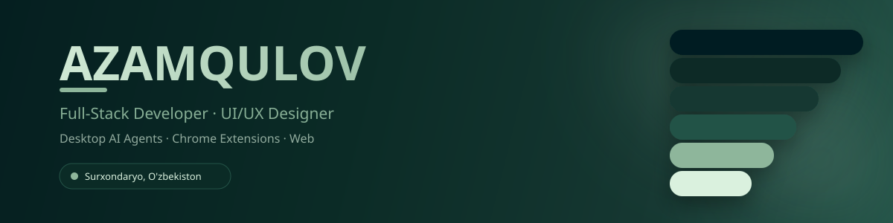
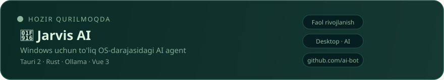

  

  

## 🧑‍💻 Обо мне

Фриланс-разработчик и UI/UX дизайнер — создаю **desktop, web и Chrome-расширения** для рынка Узбекистана и Центральной Азии. Специализируюсь на современных, анимированных интерфейсах и работаю через собственную multi-agent AI систему (**Antigravity**).

<table>
<tr>
<td width="50%" valign="top">

**🔭 Сейчас работаю над**
Desktop AI-агентом и Chrome-расширениями

**🌱 Углублённо изучаю**
Rust · Tauri 2 · Supabase

</td>
<td width="50%" valign="top">

**🎯 Цель на 2026**
Стабильный продукт с реальными пользователями

**📫 Связаться**
azamqulov0102@gmail.com

</td>
</tr>
</table>

## 🚀 Сейчас разрабатываю

## 🛠️ Технологии

**Языки**
 

  

**Desktop и Frontend**
 

  

**Backend и базы данных**
 

  

**AI и инструменты**
 

## 📊 Статистика GitHub

  

## 🕸️ График активности

## 🐍 Contribution Snake

## 🌐 Связаться со мной

 

Каждый пиксель настроен вручную 🌿

